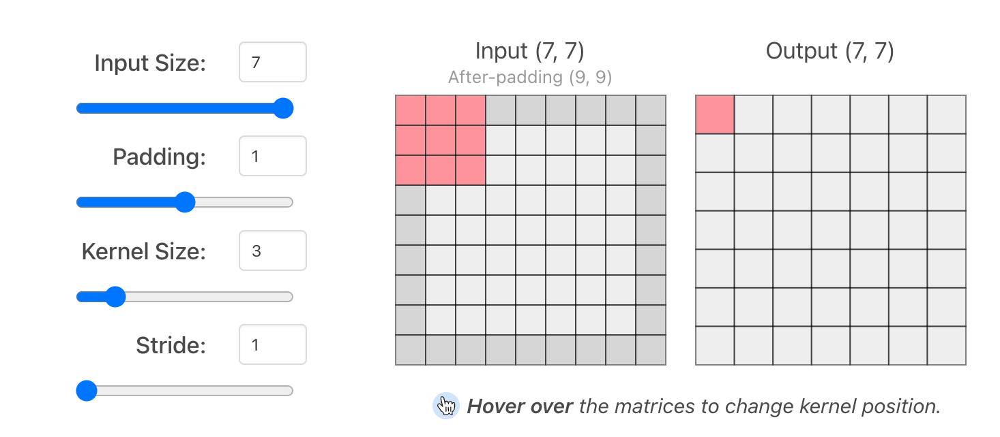
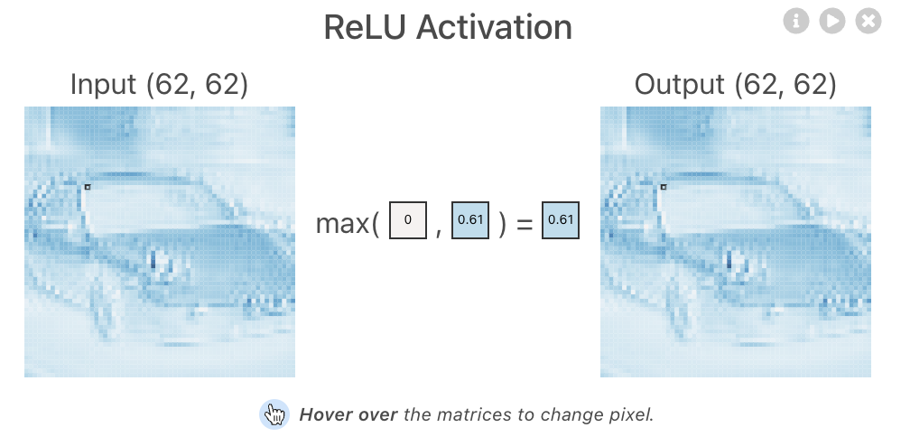
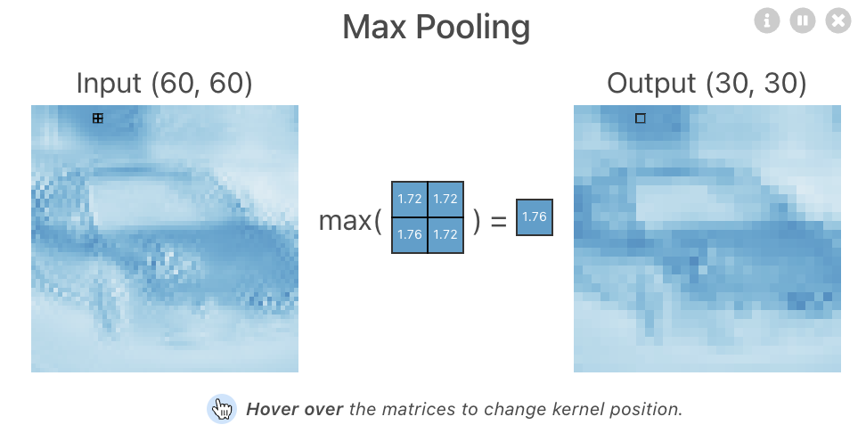
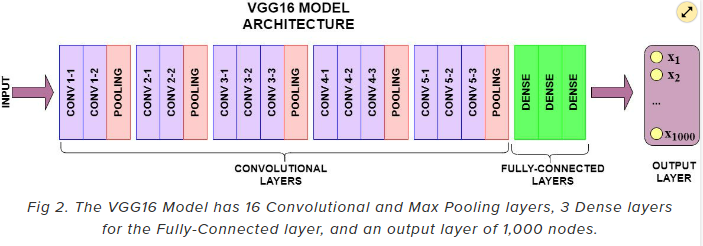
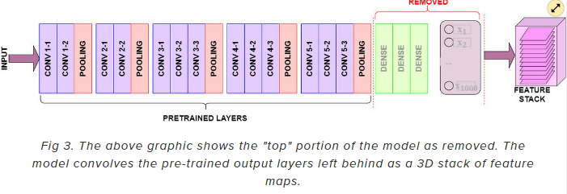

# 🦁 TIL

[TF CNN 공식 문서](https://www.tensorflow.org/tutorials/images/cnn) <br>
[영운쓰 추천 자료](https://untitledtblog.tistory.com/150)

## ✅ Convolutional Neural Network, CNN
### - 합성곱 층 만들기

* CNN은 배치(batch) 크기를 제외하고 `(이미지 높이, 이미지 너비, 컬러 채널)` 크기의 텐서(tensor)를 입력
* 보통 컬러 이미지는 컬러 채널이 3 == R, G, B
* 흑백 이미지는 1

```python
model = models.Sequential()

# Convolution layer, input_shape = (높이, 너비, 채널)
model.add(layers.Conv2D(filters=32, kernel_size=(3, 3), 
                        activation='relu', input_shape=(32, 32, 3)))

# Max Pooling 연산을 수행하는 layer
model.add(layers.MaxPooling2D(pool_size=(2, 2)))
model.add(layers.Conv2D(filters=64, kernel_size=(3, 3), activation='relu'))
model.add(layers.MaxPooling2D(pool_size=(2, 2)))
model.add(layers.Conv2D(filters=64, kernel_size=(3, 3), activation='relu'))

# 3D 출력을 1D로 펼침
model.add(layers.Flatten())
model.add(layers.Dense(64, activation='relu'))

# 10개의 클래스
model.add(layers.Dense(10))
```
* `filters`
  * 필터의 개수
* `kernel_size`
  * 커널의 크기가 작을수록 레이어 크기가 더 작아지므로 더 깊은 아키텍처 가능
  * 큰 크기의 커널은 더 적은 정부 추출 ➡️ 차원이 더 빨리 줄어들고 과소적합 가능성
  * 보통 홀 수로 사용하는 편
* `pool_size`
  * pooling 연산을 위한 커널 크기

<br>

### - Padding
[CNN explainer](https://poloclub.github.io/cnn-explainer/)



* padding 의 역할
  * 이미지가 줄어드는 것을 방지
  * 가장자리 부분의 특징을 좀 더 학습하기 위해
* `padding = 1`, `kernel_size = 3` 을 많이 사용 ➡️ 이미지가 줄어들지 않음

<br>

### - 피처맵
  * Convolution 연산 후 결과물
  * 피처맵을 만드는 이유
    * 이미지의 공간적인 특징을 추출하기 위해


[이미지 출처](https://poloclub.github.io/cnn-explainer/)

* CNN, DNN의 가장 큰 차이
* 1차원으로 flatten 해서 넣어주는게 아니라 Conv, Pooling 연산을 통해 특징을 학습하고 압축한 결과를 flatten 해서 DNN 에 넣어줍니다.
* DNN을 이미지 데이터에 사용했을 때 단점
  * `flatten()` 으로 1차원 벡터 형태로 주입을 해서 인접 공간에 대한 정보를 잃어버림
  * 1차원 형태로 주입하면 입력값이 너무 커서 오랜 시간 소요
  * Conv과 Pooling 연산을 하게 되면 데이터의 공간적인 특징을 학습
  * Pooling을 통해 데이터를 압축하여 용량이 줄고, 추상화를 하기 때문에 너무 자세하게 학습하지 않음 ➡️ 과적합 방지

<br>

### - 액티베이션맵
  * 활성화 함수를 통과한 결과물


[이미지 출처](https://poloclub.github.io/cnn-explainer/)

<br>

### - pooling layer 의 역할
* 대체적으로 컬러 이미지에서는 `MaxPooling` 을 가장 많이 사용
* 흑백 이미지에서는 `MinPooling` 을 사용하기도 함
* MaxPooling 은 가장 큰 값 반환 
* AveragePooling 은 평균 값 반환 
* MinPooling 은 최솟값 반환
* Stride 조정 가능
* 이미지의 크기를 줄이고 데이터를 압축
  * 과대적합 방지 ➡️ 이미지를 추상화 해주기 때문에 자세히 학습되지 않도록 함
  * 용량 감소
  * 계산 효율성 증가


[이미지 출처](https://poloclub.github.io/cnn-explainer/)

> * CNN 관련 논문을 보면 이 층을 얼마나 깊게 쌓는지에 대한 논문이 있음 
> * VGG16, VGG19 등은 층을 16개, 19개 만큼 깊게 만든 것을 의미
> * 30~50층까지 쌓기도 하고 100층 정도 쌓기도 함 
> * 층의 수를 모델의 이름에 붙이기도 함
> * 과거에 비해 GPU 등의 연산을 더 많이 지원하기 때문에 연산이 빨라진 덕분

<br> 


## ✅ Classification
[PIL 라이브러리 기능](https://ddolcat.tistory.com/690)

### - 데이터 불러오기
* `wget` 을 이용하여 URL에 있는 데이터 불러오기 
```python
!wget https://data.lhncbc.nlm.nih.gov/public/Malaria/cell_images.zip
!unzip cell_images.zip
```

### - 데이터 전처리
* 이미지 사이즈가 다 다르면 계산 불가능
* 이미지 사이즈를 통일해주는 단계 필요
* `PIL`, `OpenCV` 등을 활용
* 어떤 사이즈가 좋을까?
  * 계산 편의를 위해 보통 정사각형 형태로 만들어 줌
  * 원래 이미지가 왜곡될 수 있음
  * 사이즈를 작게 하면 계산 속도가 빨라짐
  * 사이즈를 크게 하면 성능이 좋아짐
  * 하이퍼 파라미터처럼 조정
  * layer 구성에 따라 보완이 가능하기도 함

```python
train_ds = tf.keras.utils.image_dataset_from_directory(
    data_dir,
    validation_split=0.2,
    subset="training",
    seed=123,
  
    # 이미지 사이즈 고정 
    image_size=(img_height, img_width),

    # 가져올 이미지 개수, 일부 이미지만 불러와 학습
    batch_size=batch_size)
```

```python
model = Sequential([
  layers.Rescaling(1./255, input_shape=(img_height, img_width, 3)),

  layers.Conv2D(filters=16, kernel_size=3, padding='same', activation='relu'),
  layers.MaxPooling2D(),
```

* `padding`
  * `‘valid’`
    * conv2d 층의 padding 매개변수의 기본값
    * 커널이 인풋 이미지 밖으로 슬라이딩 하지 않음
    * 유효한 영역만 출력, 따라서 출력 이미지 사이즈는 입력 사이즈보다 작아짐
  * `‘same’`
    * 출력 크기가 입력값과 동일해지도록 입력 이미지 주위에 0 픽셀 패딩
    * 출력 이미지 사이즈가 입력 이미지 사이즈와 동일

<br>

### - 데이터 증강
* 데이터를 증강하기 위해
  * 이미지 반전
  * 회전
  * 배율 조정
```python
data_augmentation = keras.Sequential(
  [
    layers.RandomFlip("horizontal",
                      input_shape=(img_height,
                                  img_width,
                                  3)),
    layers.RandomRotation(0.1),
    layers.RandomZoom(0.1),
  ]
)
```

* 증강을 하면 안되는 경우
  * 크롭이나 확대 ➡️ 장비 사진의 하늘에 노이즈를 확대하거나 크롭하면 문제가 될 수 있음
  * 회전이나 반전 ➡️ 6을 180도 돌리면 9가 되기 때문에 숫자 이미지를 회전하지 않음
  * 색상 변경 ➡️ 꽃의 경우 다양한 색상이 있기에 상관없지만 신호등 같이 안전과 직결되는 경우 변경 X
  * 증강은 train 에만 적용
  * 증강을 할 때는 현실 세계 문제와 연관해서 고민해봐야 함

<br> 

## ✅ Malaria image load 1001
### - 이미지 로드 방법
* matplotlib.pyplot 의 imread()를 사용하는 방법
```python
import matplotlib.pyplot as plt
img = plt.imread(paths[0])
img.shape
```

<br>

* PIL(Pillow) 로 불러오는 방법
* PIL 로 augmentation 가능
* TF 내부에서도 PIL 이나 OpenCV를 사용해서 augmentation 가능
* 이미지 편집기를 만들 수도 있음
```python
from PIL import Image, ImageFilter
original = Image.open(cell_img)
original
```

<br>  

* OpenCV로 불러오는 방법
* Computer Vision에 주로 사용하는 도구로 동영상처리 등에 주로 사용
```python
import cv2

img = cv2.imread(img_path, cv2.IMREAD_COLOR)
img = cv2.cvtColor(img, cv2.COLOR_BGR2RGB)
img.shape
```

<br> 

## ✅ Malaria CNN 1002
### - ImageDataGenerator, 이미지 데이터 전처리
```python
# ImageDataGenerator 를 통해 이미지를 로드하고 전처리
from tensorflow.keras.preprocessing.image import ImageDataGenerator

# validation_split 값을 통해 학습:검증 비율을 8:2 로 나눔
datagen = ImageDataGenerator(rescale=1/255.0, validation_split=0.2)
```
* 공간 레벨 변형
  - Flip : 상하, 좌우 반전
  - Rotation : 회전
  - Shift : 이동
  - Zoom : 확대, 축소
  - Shear : 눕히기

<br>

* 픽셀 레벨 변형
  - Bright : 밝기 조정
  - Channel Shift : RGB 값 변경
  - ZCA Whitening : Whitening 효과

<br>

### - 학습 & 검증 데이터 셋 분리
* label은 폴더명으로 정의
* class_mode : 이진분류이기 때문에 binary
* class_mode : One of "categorical", "binary", "sparse", "input", or None. Default: "categorical".
* subset: Subset of data ("training" or "validation")
```python
height = 32 
width = 32

trainDatagen = datagen.flow_from_directory(directory = 'cell_images/',
                                           target_size = (height, width),
                                           class_mode = 'binary',
                                           batch_size = 64,
                                           subset='training')
```
```python
valDatagen = datagen.flow_from_directory(directory = 'cell_images/',
                                         target_size =(height, width),
                                         class_mode = 'binary',
                                         batch_size = 64,
                                         subset='validation')
```


<br>

### - 데이터 타입별 레이어 구성
|데이터|layer|
|:----:|:----:|
|벡터 데이터(시간이나 순서가 상관 없음)|MLP (밀집층)|
|이미지 데이터(흑백 또는 컬러)| 2D 합성곱 신경망|
|스펙트로그램 오디오 데이터| 2D 합성곱 신경망이나 순환 신경망|
|텍스트 데이터| 1D 합성곱 신경망이나 순환 신경망|
|시계열 데이터(시간이나 순서가 중요함)| 1D 합성곱 신경망이나 순환 신경망|
|볼륨 데이터(예: 3D 의료 이미지)| 3D 합성곱 신경망|
|비디오 데이터(이미지의 시퀀스)| 3D 합성곱 신경망(모션 효과를 감지해야 하는 경우) <br> 특성 추출을 위해 프레임 별로 적용한 2D 합성곱 신경망 조합 <br> 특성 시퀀스를 처리하기 위해 RNN이나 1D 합성곱 신경망 조합

<br>

> 성민님 <br>
> 참고로 tensorflow.js 를 만드는 구글 브레인 팀에 의하면 conv2d 보다 tf.layers.separableConv2d(깊이별 분리 합성곱) 층이 같은 작업을 동일 하거나 훨씬 잘 수행하는 더 작고 빠른 신경망을 만들 수 있기 때문에 처음부터 신경망을 쌓는 경우라면 conv2d를 대체해서 사용하는 걸 추천한다고 함


<br> 

* CNN 모델을 학습시키는데 내 컴퓨터로 돌렸더니 메모리 오류가 났다면?
* 일단 성능과 관계 없이 돌리고 싶다! 어떻게 해결하면 좋을까?
* 돈을 쓰지 않고 해결하는 방법!
  * 이미지 사이즈를 줄인다.
  * 레이어를 줄인다.
  * 필터수를 줄인다.
  * 배치(한번에 다 불러오지 않고 나눠서 불러오게) 사이즈를 줄인다. ➡️ 모든 사진을 나눠서 조금씩 학습 

<br>

## ✅ Transfer learning
[참고 자료](https://newindow.tistory.com/254) <br>
[tf.keras.applications link](https://www.tensorflow.org/api_docs/python/tf/keras/applications) <br> 
Keras Applications are premade architectures with pre-trained weights. <br>
[keras 전이학습 가이드](https://keras.io/guides/transfer_learning/) <br>
[VGG16 API 공식 문서](https://www.tensorflow.org/api_docs/python/tf/keras/applications/vgg16/VGG16)
### - Transfer learning이란
* 특정 분야에서 학습된 신경망(pre-trained)의 일부 능력을 유사하거나 전혀 새로운 분야에서 사용되는 신경망의 학습에 이용하는 방법
* 학습 데이터의 수가 적을 때 효과적
* 전이학습 없이 학습할 때보다 훨씬 높은 정확도와 빠른 학습 속도 제공
* 전이 학습에 이용되는 pre-trained model
  * ImageNet
  * ResNet
  * GoogLeNet
  * VGGNet

```python
from tensorflow.keras.applications.vgg16 import VGG16

vgg = VGG16(include_top=False, weights='imagenet', input_shape=(height, width, 3))

model = Sequential()
model.add(vgg)
model.add(Flatten())

# 이진 분류를 위한 출력층
model.add(Dense(1, activation='sigmoid'))
```
> input_shape    optional shape tuple, only to be specified if include_top is False (otherwise the input shape has to be (224, 224, 3) (with channels_last data format) or (3, 224, 224) (with channels_first data format). It should have exactly 3 input channels, and width and height should be no smaller than 32. E.g. (200, 200, 3) would be one valid value.

<br>

### - include_top
[출처](https://www.learndatasci.com/tutorials/hands-on-transfer-learning-keras/) <br>
* 가장 상단의 fully connected layer들을 포함 시킬지의 여부
* True



* False



<br>

### - 모델 시각화
```python
from tensorflow.keras.utils import plot_model

plot_model(model)
```

<br>

### - Fine Tuning
* 모델의 파라미터를 미세하게 조정하는 행위
* 전이 학습 이후 나의 Task에 맞게 모델 파라미터를 업데이트하는 것

<br>

## ✅ weather classification
```python
def img_read_resize(img_path):
    img = cv2.imread(img_path)

    # cv에사는 BGR 사용, RGB로 변경
    img = cv2.cvtColor(img, cv2.COLOR_BGR2RGB)

    # 이미지 사이즈 통일
    img = cv2.resize(img, (120, 120))
    return img
```

```python
def img_folder_read(img_label):
    """
    특정 이미지 폴더에 있는 이미지를 array 형태로 리스트에 담아주는 함수
    """
    # 이미지와 레이블을 담아줄 리스트
    img_files = []
    labels = []

    # 이미지 레이블(폴더명)을 받아 이미지 경로 확인
    wfiles = glob.glob(f"{root_dir}/{img_label}/*")

    # 이미지 번호대로 경로 정렬
    wfiles = sorted(wfiles)

    # 경로 리스트를 순회하면서 이미지 경로 하나씩 확인
    for w_img in wfiles:
        try:
            # 이미지 사이즈 조정해서 리스트에 추가
            # 형식에 맞지 않는 이미지가 들어올 경우 에러
            img_files.append(img_read_resize(w_img))
            labels.append(img_label)
        except:
            continue

    return img_files, labels
```

<br>

### - train_test_split
* `fit(validation_split)`으로 나눠도 됨
  * class가 균일하게 나눠지지 않는 단점 있음


> RGB 왜 255? <br>
> 현대의 대부분 모니터의 최대 지원 색 심도는 24비트입니다. (물론 더 많이 지원하는 모니터 들도 많이 나왔습니다)
즉 각 픽셀은 2^24(~16.7M)의 색상을 표시할 수 있게 되어있고
24비트 값을 각각 R G B  세개의 색상으로 나누자면 24비트 / 3이므로
각 채널의 폭은 8비트를 가지게 되게 되었습니다.
채널당 8비트라는것을 고려할때 0 ~ 255 (256개)의 숫자 값만 인코딩 할 수 있게 되는 것이 이치에 맞습니다.


<br>

### - from_logits
[참고 자료](https://hwiyong.tistory.com/335)
 
* 모델의 출력값이 문제에 맞게 normalize 되었느냐의 여부 
* 예를 들어, 10개의 이미지를 분류하는 문제에서는 주로 softmax 함수를 사용
* 이때, 모델이 출력값으로 해당 클래스의 범위에서의 확률을 출력한다면, 이를 logit=False라고 표현
* logit이 아니라 확률값
* 반대로 모델의 출력값이 sigmoid 또는 linear를 거쳐서 확률이 아닌 값이 나오게 된다면, logit=True라고 표현
* 말 그대로 확률이 아니라 logit

>클래스 분류 문제에서 softmax 함수를 거치면 from_logits = False(default),
그렇지 않으면 from_logits = True.

```python
model.compile(optimizer='adam',
              loss=tf.keras.losses.SparseCategoricalCrossentropy(from_logits=True),
              metrics=['accuracy'])
```

<br>

* `history` 시각화를 해봤을 때 더 이상 val_loss 값이 감소하지 않는데, loss 값은 줄어든다면 오버피팅 되었다고 판단
* 딱 수치가 얼마가 차이가 나면 오버피팅이다 이렇게 공식으로 얘기는 잘 하지 않는 편
* val_loss 값이 나아지지 않는데 loss 값만 나아진다면 확실하게 오버피팅이라고 볼 수 있음


<br>

### - Tensorflow callback function
[참고 자료](restore_best_weights)


|parameter|설명|
|:---:|:---:|
|`monitor`|EarlyStopping의 기준이 되는 값|
|`min_delta`|개선된 것으로 간주하기 위한 최소한의 변화량|
|`patience`|monitor되는 값의 개선이 없을 경우, 무시하고 학습을 계속하는 횟수|
|`verbose`|0 or 1 <br> 0일 경우, 화면에 나타냄 없이 종료 <br> 1일 경우 화면에 출력|
|`mode`|`auto` or `min` or `max` <br> monitor 값이 최소가 되어야 하는지 최대가 되어야 하는지 설정 <br> `auto` 는 모델이 알아서 판단|
|`baseline`|모델이 달성해야하는 최소한의 기준값|
|`restore_best_weights`|가장 좋은 성능으로 되돌릴 수 파라미터 <br> True라면 monitor 값이 가장 좋았을 때의 weight로 복원|


<br>

### - FC층을 첫 layer부터 사용하지 않고 합성곱 연산을 사용한 이유
[참고 자료](https://excelsior-cjh.tistory.com/180)
* FC Layer는 flatten이 필요하기 때문에 지나치게 계산이 복잡해지고, 공간정보가 많이 손실