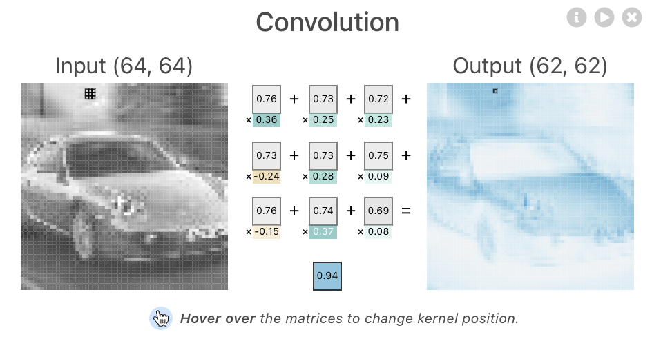

# 🦁 TIL

[TF CNN 공식 문서](https://www.tensorflow.org/tutorials/images/cnn) <br>
[영운쓰 추천 자료](https://untitledtblog.tistory.com/150)

## ✅ Convolutional Neural Network, CNN
### - 합성곱 층 만들기

* CNN은 배치(batch) 크기를 제외하고 `(이미지 높이, 이미지 너비, 컬러 채널)` 크기의 텐서(tensor)를 입력
* 보통 컬러 이미지는 컬러 채널이 3 == R, G, B
* 흑백 이미지는 1

```python
model = models.Sequential()

# Convolution layer, input_shape = (높이, 너비, 채널)
model.add(layers.Conv2D(filters=32, kernel_size=(3, 3), 
                        activation='relu', input_shape=(32, 32, 3)))

# Max Pooling 연산을 수행하는 layer
model.add(layers.MaxPooling2D(pool_size=(2, 2)))
model.add(layers.Conv2D(filters=64, kernel_size=(3, 3), activation='relu'))
model.add(layers.MaxPooling2D(pool_size=(2, 2)))
model.add(layers.Conv2D(filters=64, kernel_size=(3, 3), activation='relu'))

# 3D 출력을 1D로 펼침
model.add(layers.Flatten())
model.add(layers.Dense(64, activation='relu'))

# 10개의 클래스
model.add(layers.Dense(10))
```
* `filters`
  * 필터의 개수
* `kernel_size`
  * 커널의 크기가 작을수록 레이어 크기가 더 작아지므로 더 깊은 아키텍처 가능
  * 큰 크기의 커널은 더 적은 정부 추출 ➡️ 차원이 더 빨리 줄어들고 과소적합 가능성
  * 보통 홀 수로 사용하는 편
* `pool_size`
  * pooling 연산을 위한 커널 크기

<br>

### - Padding
[CNN explainer](https://poloclub.github.io/cnn-explainer/)


* padding 의 역할
  * 이미지가 줄어드는 것을 방지
  * 가장자리 부분의 특징을 좀 더 학습하기 위해
* `padding = 1`, `kernel_size = 3` 을 많이 사용 ➡️ 이미지가 줄어들지 않음

<br>

### - 피처맵
  * Convolution 연산 후 결과물
  * 피처맵을 만드는 이유
    * 이미지의 공간적인 특징을 추출하기 위해


[이미지 출처](https://poloclub.github.io/cnn-explainer/)

* CNN, DNN의 가장 큰 차이
* 1차원으로 flatten 해서 넣어주는게 아니라 Conv, Pooling 연산을 통해 특징을 학습하고 압축한 결과를 flatten 해서 DNN 에 넣어줍니다.
* DNN을 이미지 데이터에 사용했을 때 단점
  * `flatten()` 으로 1차원 벡터 형태로 주입을 해서 인접 공간에 대한 정보를 잃어버림
  * 1차원 형태로 주입하면 입력값이 너무 커서 오랜 시간 소요
  * Conv과 Pooling 연산을 하게 되면 데이터의 공간적인 특징을 학습
  * Pooling을 통해 데이터를 압축하여 용량이 줄고, 추상화를 하기 때문에 너무 자세하게 학습하지 않음 ➡️ 과적합 방지

<br>

### - 액티베이션맵
  * 활성화 함수를 통과한 결과물


[이미지 출처](https://poloclub.github.io/cnn-explainer/)

<br>

### - pooling layer 의 역할
* 대체적으로 컬러 이미지에서는 `MaxPooling` 을 가장 많이 사용
* 흑백 이미지에서는 `MinPooling` 을 사용하기도 함
* MaxPooling 은 가장 큰 값 반환 
* AveragePooling 은 평균 값 반환 
* MinPooling 은 최솟값 반환
* 이미지의 크기를 줄이고 데이터를 압축
  * 과대적합 방지 ➡️ 이미지를 추상화 해주기 때문에 자세히 학습되지 않도록 함
  * 용량 감소
  * 계산 효율성 증가


[이미지 출처](https://poloclub.github.io/cnn-explainer/)

> * CNN 관련 논문을 보면 이 층을 얼마나 깊게 쌓는지에 대한 논문이 있음 
> * VGG16, VGG19 등은 층을 16개, 19개 만큼 깊게 만든 것을 의미
> * 30~50층까지 쌓기도 하고 100층 정도 쌓기도 함 
> * 층의 수를 모델의 이름에 붙이기도 함
> * 과거에 비해 GPU 등의 연산을 더 많이 지원하기 때문에 연산이 빨라진 덕분