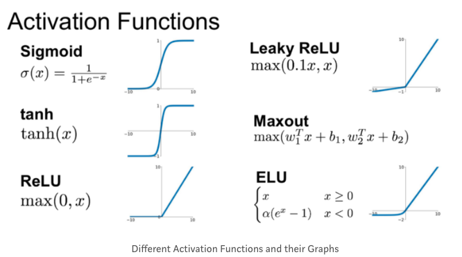

# 🦁 Deep Learning repository 🦁


## ✅ 머신러닝과 딥러닝

* 머신러닝 
  * 인간이 직접 특징을 도출할 수 있게 설계하여 예측값 출력
* 딥러닝
  * 인공지능 스스로 일정 범주의 데이터를 바탕으로 공통된 특징 도출
  * 그 특징으로 예측값 출력
  * 주로 비정형 데이터를 다룸

<br>

* Fully Connected Network 에는 1차원 형태로 네트워크에 데이터를 주입해야 함
* 어떻게 비정형 데이터(표형태가 아니라 이미지, 음성, 텍스트 등)를 잘 다룰까?
* 전처리 레이어에서 이미지, 음성, 텍스트 등을 전처리 하는 기능을 따로 제공
* 1950 년대 이전부터 신경망 연구
* 그렇지만 하드웨어의 한계와 데이터 부족으로 정체


<br>

## ✅ 순전파와 역전파
### - 순전파
* 인공 신경망에서 입력층에서 출력층 방향으로 예측값의 연산이 진행되는 과정
* 입력값은 입력층, 은닉층을 지남
* 각 층에서 가중치와 함께 연산되어, 출력층에서 모든 연산을 마친 예측값 출력 


### - 역전파
* 순전파와 반대로 출력층에서 입력층 방향으로 계산하면서 가중치 업데이트
* 역전파를 통해 가중치 비율을 조정하여 오차 감소 진행
* 다시 순전파 진행으로 오차 감소 확인

### - 활성화 함수
* 은닉층과 출력층의 뉴런에서 출력값을 결정하는 함수
* 입력값들의 수학적 선형 결합을 다양한 형태의 `비선형` 결합으로 변환하는 역할


 <br>

[출처](https://medium.com/@kmkgabia/ml-sigmoid-%EB%8C%80%EC%8B%A0-relu-%EC%83%81%ED%99%A9%EC%97%90-%EB%A7%9E%EB%8A%94-%ED%99%9C%EC%84%B1%ED%99%94-%ED%95%A8%EC%88%98-%EC%82%AC%EC%9A%A9%ED%95%98%EA%B8%B0-c65f620ad6fd) <br>


<br>

### - 기울기 소실
* 깊은 인공 신경망을 학습할 때 역전파 과정에서 입력층으로 갈수록 기울기가 점차 작아지는 현상
* 입력층에 가까운 층들에서 가중치들이 업데이트가 제대로 되지 않으면 최적의 모델을 찾을 수 없음
* `ReLU` 함수
  * 기울기 소실을 완화하는 가장 간단한 방법
  * 미분 계산이 훨씬 간편해져 학습 속도 개선
  * 단점 : Dying ReLU (x가 0보다 작거나 같으면 항상 동일한 값인 0을 출력하기 때문에 발생)
* `Leaky ReLU`
  * Dying ReLU 현상을 해결하기 위해 나온 변형 함수
  * 입력값이 음수일 경우 0이 아니라 매우 작은 값 반환
  
### - 기울기 폭주
* 기울기 소실의 반대 경우로 기울기가 점차 커지더니 가중치들이 비정상적으로 커지는 것
* 순환 신경망(RNN)에서 쉽게 발생


<br>


## ✅ 코드
```python
model = tf.keras.models.Sequential([
  # 입력층
  tf.keras.layers.Flatten(input_shape=(28, 28)),
  
  # 은닉층
  tf.keras.layers.Dense(128, activation='relu'),

  # dropout layer
  tf.keras.layers.Dropout(0.2),

  # 출력층
  tf.keras.layers.Dense(10, activation='softmax')
])

model.compile(optimizer='adam',
              loss='sparse_categorical_crossentropy',
              metrics=['accuracy'])
```

* dropout
  * 딥러닝 모델의 일부 노드를 제거하고 사용하는 것
  * 과대적합, 오버피팅을 방지하기 위함
* optimizer
  * 오차가 최소가 되는 지점을 찾기 위한 파라미터
  * 기울기, 방향, learning rate를 고려 
* loss : 손실율 측정
* metrics : 평가지표
* 시그모이드의 경우 활성 함수로는 잘 쓰지 않지만 이진 분류의 경우 출력 함수로 쓰임  
    ||시그모이드|소프트맥스|
    |:----:|:----:|:-----:|
    |분류 종류|이진 분류|다중 클래스 분류|
    |반환 값|1개로 반환|N개로 반환되며 모든 확률의 합이 1|
    |값 선택|특정 임계값에 따라 값을 선택|가장 큰 값으로 반환되는 값을 해당 클래스로 선택|

<br>

### - 최적화 함수
* 손실함수를 최소화하는 방향으로 가중치를 갱신하는 알고리즘
* 경사하강법에 기반을 둔 optimizer 로는 `SGD`, `RMSProp`, `Adagrad`, `Adam` 
* `SGD`, `Adam`, `RMSprop` 을 가장 많이 사용
* 경사하강법 외 여러가지 지정할 수도 있지만 `adam` 에 비해 대부분 느린 속도
* 대체적으로 `adam` 이 빠르고 학습도 잘하는 편

 <br>
[출처](https://east-rain.github.io/docs/Deep%20Learning/basic%20deeplearning/optimization.html)

