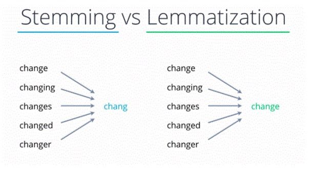

# 🦁 TIL

## ✅ Natural Language Processing, NLP
* 자연어 의미를 분석하여 컴퓨터가 처리할 수 있도록 하는 일
* 자연어(natural language) : 우리가 일상 생활에서 사용하는 언어
* 기계에게 인간의 언어를 이해시키는 인공지능의 한 분야

 

### - 자연어 처리로 할 수 있는 일
* 음성 인식, 내용 요약, 번역
* 사용자의 감성 분석
* 텍스트 분류 작업(스팸 메일 분류, 뉴스 기사 카테고리 분류)
* 질의 응답 시스템, 챗봇 등 

 

### - 자연어 분류 과정
* 데이터 나누기와 벡터화 과정은 바뀔 수 있음
* 데이터 로드 ➡️ 텍스트 데이터 전처리 ➡️ 텍스트 데이터 벡터화 ➡️ 데이터 나누기 ➡️ 학습
* 데이터 로드 ➡️ 텍스트 데이터 전처리 ➡️ 데이터 나누기 ➡️ 텍스트 데이터 벡터화 ➡️ 학습

 

### - 데이터 정제 및 전처리
* 이상치 과적합 방지
* 텍스트 정제 ➡️ 신호와 소음을 구분
1. HTML 태그, 특수문자, 이모티콘
2. 정규 표현식
   * 문자, 숫자, 특수문자를 제외할 때 주로 사용
   * 특정 패턴으로 텍스트 전처리 시 사용
   * 그 자체로 프로그래밍 언어 
3. 불용어, Stopword
   * 문장에 자주 등장하지만 "우리, 그, 그리고, 그래서" 등 관사, 전치사, 조사, 접속사 등의 단어로 문장 내에서 큰 의미를 갖지 않는 단어
4. 어간 추출, Stemming
5. 음소표기법, Lemmatizing

* `NLTK`, `Spacy`
  * 대표적인 텍스트 전처리 도구 
  * 토큰화, steming, lematization, 불용어 등의 기능 제공
  * 잘 사용하지 않을 예정 ➡️ 한글 미지원

 

* `stemming` vs `lematization`

  
[출처](https://www.turing.com/kb/stemming-vs-lemmatization-in-python)

 

### - 토큰화, Tokenization
* 패턴을 찾는 것에 유용, 형태소 분석 및 표제어를 위한 기본 단계
* 토큰, token : 문자열을 분석을 위한 문자열 단위로 단어, 문자 또는 하위 단어
* 토큰 생성, tokenizing : 문자열을 토큰으로 나누는 작업

 

## ✅ Bag Of Words, BOW

* `Bag Of Words`, `TF-IDF` : 단어를 숫자로 인코딩 하는 방법
* 단어들의 순서를 전혀 고려하지 않고 단어들의 출현 빈도에만 집중
* 가장 간단하고 효과적이라 널리 쓰이는 방법
* 단어의 순서가 완전히 무시된다는 단점
  * 이를 보완하기 위해 `n-gram` 사용
  * [n-gram 참고 자료](https://heytech.tistory.com/343)
    * 모든 단어를 고려하는 것이 아니라 일부 단어만 고려하는 접근 방법
    * 일부 단어를 묶어서 사용
    * 앞뒤 맥락 고려 
  * BOW는 하나의 토큰 사용, n-gram은 n개의 토큰 사용

 

### - CountVectorizer
* sklearn에서 제공하는 bag of words 를 만들 수 있는 API
* 텍스트 문서 모음을 토큰 수의 행렬로 변환
* 단어들의 카운트(출현 빈도)로 여러 문서들을 벡터화
* 문서목록에서 각 문서의 feature(문장의 특징) 노출수를 가중치로 설정한 BOW 벡터를 생성
* 카운트 행렬, 단어 문서 행렬 (Term-Document Matrix, TDM))
* max_df, min_df 인수를 사용하여 문서에서 토큰이 나타난 횟수를 기준으로 단어장을 구성 
* 토큰의 빈도가 max_df로 지정한 값을 초과 하거나 min_df로 지정한 값보다 작은 경우에는 무시하며 인자 값은 정수인 경우 횟수, 부동소수점인 경우 비율을 의미
* [API documentation](https://scikit-learn.org/stable/modules/generated/sklearn.feature_extraction.text.CountVectorizer.html)

### - 사용법
1. 문서를 토큰 리스트로 변환
2. 각 문서에서 토큰의 출현 빈도를 셈
3. 각 문서를 BOW 인코딩 벡터로 변환
4. 매개 변수
    * `analyzer` : 단어, 문자 단위의 벡터화 방법 정의
    * `ngram_range` : BOW 단위 수 (1, 3) 이라면 1개~3개까지 토큰을 묶어서 벡터화
    * `max_df` : 어휘를 작성할 때 문서 빈도가 주어진 임계값보다 높은 용어(말뭉치 관련 불용어)는 제외 (기본값=1.0)
        * 너무 많이 등장하는 단어를 제외하는 효과
        * `max_df=0.9` : 문서의 90% 이상에 나타나는 단어 제외
        * `max_df=10` : 10개 이상의 문서에 나타나는 단어 제외
    * `min_df` : 어휘를 작성할 때 문서 빈도가 주어진 임계값보다 낮은 용어는 제외합니다. 컷오프라고도 합니다.(기본값=1.0)
        * 너무 적게 등장하는 단어를 제외하는 효과 
        * `min_df=0.01` : 문서의 1% 미만으로 나타나는 단어 제외
        * `min_df=10` : 문서에 10개 미만으로 나타나는 단어 제외
    * `stop_words` : 불용어 정의
    * `max_features` : 어휘의 양을 제한
      * `max_features=10` : 10개의 단어만 추출
      * 단어를 너무 많이 사용해서 dtm 이 커지는 것을 방지하기 위함

 

### - TF-IDF
* TF(단어 빈도, term frequency)
* 특정한 단어가 문서 내에 얼마나 자주 등장하는지를 나타내는 값
* 이 값이 높을수록 문서에서 중요하다고 생각할 수 있음
* 하지만 단어 자체가 문서군 내에서 자주 사용되는 경우, 이것은 그 단어가 흔하게 등장한다는 것을 의미
* 이것을 DF(문서 빈도, document frequency)라고 함
* 이 값의 역수를 IDF(역문서 빈도, inverse document frequency)라고 함 
* TF-IDF는 TF와 IDF를 곱한 값

IDF 값은 문서군의 성격에 따라 결정된다. 예를 들어 '원자'라는 낱말은 일반적인 문서들 사이에서는 잘 나오지 않기 때문에 IDF 값이 높아지고 문서의 핵심어가 될 수 있지만, 원자에 대한 문서를 모아놓은 문서군의 경우 이 낱말은 상투어가 되어 각 문서들을 세분화하여 구분할 수 있는 다른 낱말들이 높은 가중치를 얻게 된다.

* TF-IDF 전체 문서에서는 자주 등장하지 않지만 특정 문서에서 자주 등장한다면 가중치 값이 높게 나옴
* 모든 문서에 자주 등장하는 값은 가중치가 낮게 나옴

