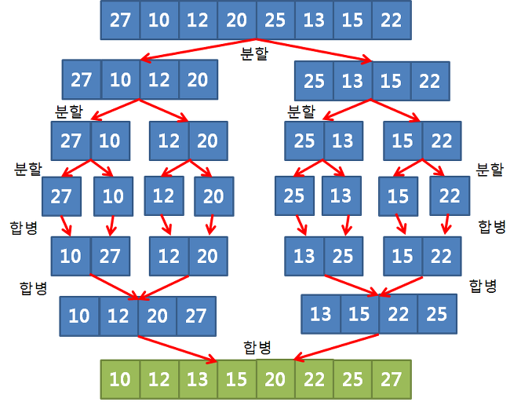
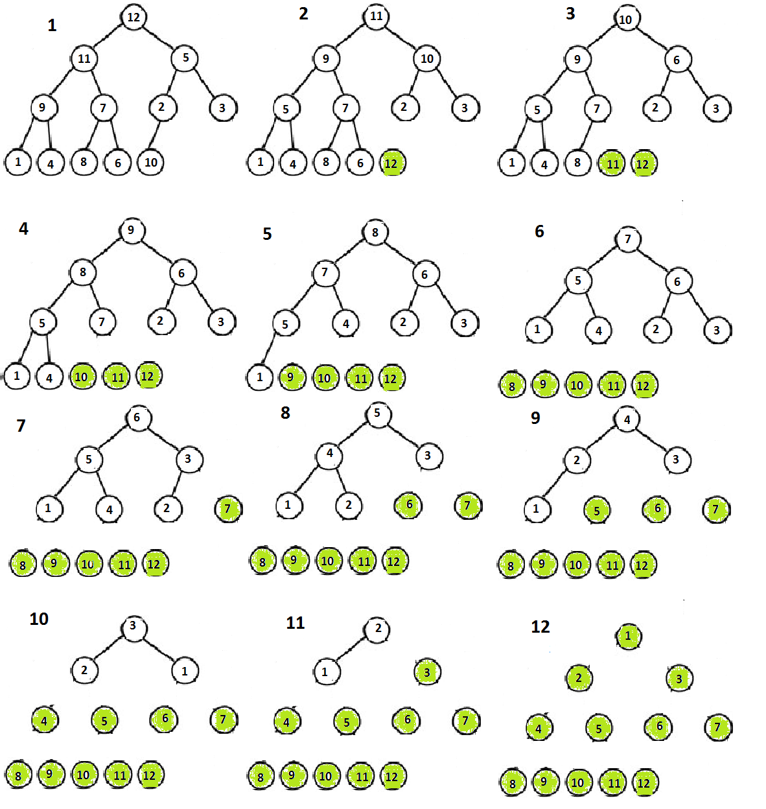
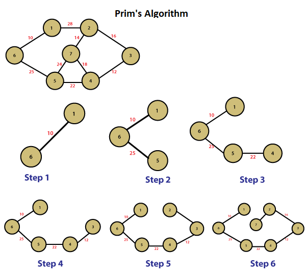

# 🦁 Algorithm

[참고 자료](https://github.com/boostcamp-ai-tech-4/ai-tech-interview/blob/main/answers/8-algorithm.md#2-6)

## ✅ Time Complexity
* 시간 복잡도(Time Complexity) : 알고리즘에 사용되는 `연산 횟수`의 총량
* 공간 복잡도(Space Complexity) : 알고리즘에 사용되는 `메모리 공간`의 총량

 

* 알고리즘의 복잡도는 `점근적 표기법`으로 나타냄
  * [점근 표기법 위키백과](https://ko.wikipedia.org/wiki/%EC%A0%90%EA%B7%BC_%ED%91%9C%EA%B8%B0%EB%B2%95)
  * 어떤 함수의 증가 양상을 다른 함수와의 비교로 표현하는 수론과 해석학의 방법
  * 알고리즘의 복잡도를 단순화할 때나 무한급수의 뒷부분을 간소화할 때 쓰인다.
* 점근적 표기법에는 대표적으로 O(빅오), Ω(오메가), Θ(세타)가 있다.

 

* `O Notation (빅오 표기법)` : 점근적 상한선 / 최악의 경우
* `Ω Notation (오메가 표기법)` : 점근적 하한선 / 최상의 경우
* `θ Notation (세타 표기법)` : 점근적 상한선과 점근적 하한선의 교집합 / 평균의 경우
> 일반적으로 최악의 경우의 성능을 측정하는 빅오 표기법을 많이 사용

 

## ✅ Sorting Algorithm
[정렬 참고 영상](https://www.youtube.com/watch?v=EdIKIf9mHk0&list=PLOmdoKois7_FK-ySGwHBkltzB11snW7KQ&ab_channel=megaovermoc)  

### - Insert Sort
* 배열의 시작부터 끝까지 비교해가면서 적절한 위치에 삽입하는 정렬 알고리즘
* 시간 복잡도
  * 최악 : $O(N^2)$
  * 평균 : $O(N^2)$
  * 최선 : $O(N)$
1. 0번 부터 n번까지 확인
2. 왼쪽에 있는 원소가 확인 중인 원소보다 작을 때까지 왼쪽으로 이동

  
[사진 출처](https://runestone.academy/ns/books/published/pythonds/SortSearch/TheInsertionSort.html)

 

### - Bubble Sort 
* 시간 복잡도
  * $O(N^2)$  
1. n, (n+1) 원소 확인
2. (n+1)이 작다면 swap 하고 (n+1), (n+2) 확인
3. 정렬될 때까지 반복

  
[사진 출처](https://runestone.academy/ns/books/published/pythonds/SortSearch/TheBubbleSort.html)

 

### - Merge Sort
* 리스트를 잘게 쪼갠 뒤 두 개씩 크기 비교 후 정렬
* 분리된 리스트를 재귀적으로 합쳐서 정렬 완성
* 분할된 리스트를 저장해둘 공간 때문에 메모리 소모량이 큰 편
* 시간 복잡도
  * 최악, 평균, 최선 가리지 않고 항상 일정한 속도
  * $O(N\log N)$
1. 리스트를 반으로 나눔
2. 왼쪽 리스트와 오른쪽 리스트를 각각 정렬
3. 정렬된 두 리스트를 하나의 정렬된 리스트로 합병 

  
[사진 출처](https://wonjayk.tistory.com/221)

 

### - Quick Sort
* 대개 효율적이지만 Pivot이 잘못 선택되면(내림차순 정렬 되어 있는 경우) 시간 복잡도가 $O(N^2)$
* 파이썬 sort 메서드가 quick sort로 구현되어 있고 $O(N^2)$을 방지하고자 정렬 전 리스트를 한 번 섞어주는 것으로 알고 있음
* 시간 복잡도 
  * 최악 : $O(N^2)$
  * 평균 : $O(N\log N)$
  * 최선 : $O(N\log N)$
1. Pivot을 정한다
2. Pivot보다 작은 값은 왼쪽, 큰 값은 오른쪽에 둔다.
3. Pivot 기준으로 Pivot은 제외하고 리스트 분할
4. 1 ~ 3 반복

 

### - Select Sort
* 주어진 배열 중에 최댓값을 찾아 정렬되지 않은 배열의 맨 뒤의 값과 자리를 바꿈
* 배열의 맨 뒤부터 차례로 정렬
* 시간 복잡도
  * $O(N^2)$

  
[사진 출처](https://runestone.academy/ns/books/published/pythonds/SortSearch/TheSelectionSort.html)

 

### - Heap Sort
* `Heap` : 아래 두 조건을 만족하는 트리
  1. 완전 이진 트리, 노드의 개수가 $n$개일 때 높이 $O(lg(n))$
  2. 모든 노드는 자식 노드보다 크거나 같음 ➡️ `root node는 항상 max 값`

* `Heapify`
  * 부모, 자식 노드들을 비교 후 가장 큰 노드가 부모가 되도록 자리 변경
  * 최악은 가장 큰 노드가 leaf node인 경우
  * root node 까지 가기 위해 트리 높이만큼 비교 & 재배치 ➡️ 최악 시간 복잡도 : $O(lg(n))$

* 정렬 단계
  1. `Heapify` 로 힙 생성
  2. root node == max
  3. root node를 떼어내고 나머지 노드들로 다시 `Heapify`
  4. 노드 개수만큼 반복

* 시간 복잡도 
  * 최악 : $O(N\log N)$
  * 평균 : $O(N\log N)$
  * 최선 : $O(N\log N)$

  
[사진 출처](https://github.com/boostcamp-ai-tech-4/ai-tech-interview/blob/main/answers/8-algorithm.md#2-6)

 

## ✅ Graph

### - BFS
* 그래프 전체를 탐색하는 방법 중 하나
* 현재 확인하는 노드의 인접한 노드들을 먼저 탐색
* 시작 정점으로부터 가까운 정점을 먼저 방문, 떨어져 있는 정점을 나중에 방문
* 주로 최단 경로 혹은 임의의 경로를 찾고 싶을 때 사용

#### 장점
* 노드의 수가 적고 깊이가 얕은 경우 빠르게 동작
* 단순 검색 속도가 DFS 보다 빠름
* 너비를 우선 탐색하기에 경로가 여러개인 경우에도 최단 경로 보장
* 최단 경로가 존재한다면 어느 한 경로가 무한히 깊어져도 반드시 찾을 수 있음
#### 단점
* 재귀호출의 DFS와 달리 queue에 탐색할 정점들을 저장해야 하므로 많은 저장 공간 필요
* 노드의 수가 늘어나면 탐색해야하는 노드 또한 증가 ➡️ 비현실적

 

### - DFS
* 그래프 전체를 탐색하는 방법 중 하나
* 시작점에서 다음 branch로 넘어가기 전 해당 branch를 완벽하게 탐색하고 넘어가는 방법
* 더 이상 탐색할 노드가 없다면 이전 노드로 돌아가 다른 branch를 다시 깊이 파보는 형식

#### 장점
* 현재 경로의 노드들만 기억하면 되므로, 저장 공간의 수요가 비교적 적음
* 목표 노드가 깊은 단계에 있는 경우에도 해를 빨리 구할 수 있음
* 구현이 BFS 보다 간단

#### 단점
* 단순 검색 속도가 BFS 보다 느림
* 해를 구하면 탐색 종료 ➡️ 구한 해가 최단 경로를 보장하지 못함
* 경로가 다수인 경우 모든 경로를 전부 확인해야 함

> * 노드를 Queue 혹은 Stack에 넣을 때, 반드시 방문 여부를 표시해야 함
> * 그렇지 않으면 무한 루프에 빠질 수 있음

 

### - 최단 경로
* 한 노드에서 다른 노드로 가는 cost가 주어졌을 때, cost가 가장 적게 드는 경로를 찾는 알고리즘
* 대표 알고리즘 : `Dijkstra`, `Floyd-Warshall`, `Bellman-Ford`

 

### - `Dijkstra`
1. 출발 노드 설정
2. 최단 거리 테이블 초기화
3. 방문하지 않는 노드 중 최단 거리가 가장 짧은 노드 선택
4. 해당 노드르르 거쳐 다른 노드로 가는 비용 계산하여 최단 거리 테이블 갱신
5. 3 ~ 4번 반복

* 개선된 다익스트라 알고리즘
  * 전체 노드의 개수가 5,000개 이하라면 일반적으로 1번 다익스트라 알고리즘으로 해결 가능
  * 10,000개를 넘어가는 문제라면 개선된 다익스트라 알고리즘을 이용해야 함

1. 최단 거리 테이블 무한으로 초기화
2. 시작 노드 방문 처리, 우선순위 큐에 삽입
3. 최단 거리의 노드에 대한 정보 pop
4. 최단 거리 테이블에 기록된 비용보다 크다면 무시
5. 연결된 인접 노드 확인
6. 현재 노드를 거쳐 다른 노드로 이동하는 것이 거리가 더 짧은 경우 최단 거리 테이블 갱신

 

* 다익스트라 시간 복잡도 : $O(V^2)$
* 개선된 다익스트라 시간 복잡도 : $O(E \log V)$

 

* 개선된 다익스트라 알고리즘에서는 힙 자료구조를 사용
* 특정 노드까지의 최단 거리에 대한 정보를 힙에 담아서 처리하므로 출발 노드로부터 가장 거리가 짧은 노드를 더욱 빠르게 찾을 수 있음
* 선형 시간이 아닌 로그 시간이 걸림, N = 1,000,000일 때 약 20

 

### - `Floyd-Warshall`

 

### - `Bellman-Ford`

 

### - MST, Minimum Spanning Tree
#### Spanning Tree, 신장 트리
* 그래프에서 일부 간선을 선택해서 만든, 그래프 내의 모든 정점을 포함하는 트리
* 그래프가 n개의 정점을 가질 때, 최소 (n-1)개의 간선이 필요
* 트리 형식을 만족해야 하므로 사이클을 포함해서는 안됨
* 하나의 그래프에는 많은 신장 트리 존재

#### Minimum Spanning Tree, 최소 신장 트리
* 신장 트리 중 간선들의 가중치 합이 최소인 트리
* 최소 비용과, 간선들로 모든 정점들을 연결하는 것
* 대표 알고리즘 
  * `Kruskal` : 그래프 내 적은 숫자의 간선만들 가지는 희소 그래프의 경우 적합
  * `Prim` : 그래프에 간선이 많이 존재하는 밀집 그래프의 경우 적합

#### `Prim`
* 시작 정점에서 출발하여 단계적으로 확장
* 정점 선택을 기반으로 하는 알고리즘

1. 시작 정점의 인접 노트 탐색
2. 인접한 노드들 중 최소 간선으로 연결된 정점 선택하여 트리 확장 
3. 간선이 (n-1)개가 될 때까지 트리 확장

* 시간 복잡도 : $O(n^2)$
  * 정점의 수 n만큼 반복하고, 내부 반복문이 n번 반복

  
[사진 출처](https://www.javatpoint.com/prims-algorithm-java)

 

#### `Kruskal`
* 간선 선택을 기반으로 하는 알고리즘
* 이전 단계에서 만들어진 신장 트리와 상관없이 무조건 최소 간선만을 선택
* 매 단계 사이클을 만들지 않는 최소 간선 채택

1. 그래프들의 간선들을 가중치의 오름차순으로 정렬
2. 정렬된 간선 리스트에서 순서대로 사이클을 형성하지 않는 간선을 선택하여 확장
3. 사이클을 형성하는 간선은 제외

* 시간 복잡도 : $O(E \log_2 E)$

 

### - Union Find
* 서로소 부분 집합들로 나눠진 원소들에 대한 정보를 다루는 자료구조
* Union, Find 연산을 제공
    * `Union` : 두 개의 집합을 하나의 집합으로 합침
    * `Find` : 노드가 속한 집합을 반환

* 사이클을 판별할 수 있음
  * 간선으로 연결된 두 노드의 루트 노드를 확인
  * 만약 루트 노드가 서로 다르다면 Union 연산을 수행
  * 만약 루트 노드가 서로 같다면 Union 했을 때 사이클이 발생한다고 판단

 

### - Topological Sort, 위상 정렬
* 방향 그래프의 모든 노드를 선행 순서를 지키며 정점을 순서대로 나열하는 것
* 대표적 예시 : 대학교 선수과목
  
1. 진입차수가 0인 노드를 큐에 삽입
2. 큐가 빌 때까지 다음을 반복 
   * 큐에서 요소를 꺼내 해당 노드에서 출발하는 간선을 그래프에서 제거
   * 새롭게 진입차수가 0이 된 노드를 큐에 삽입

* 만약 노드를 방문하기 전 큐가 빈다면 사이클이 존재한다고 판단할 수 있음
* 사이클이 존재하는 경우 사이클을 형성하는 노드들의 진입차수가 항상 1이상이므로 큐에 넣을 수가 없기 때문

> 진입차수(degree)
> * 노드의 관점에서 들어오는 간선의 개수