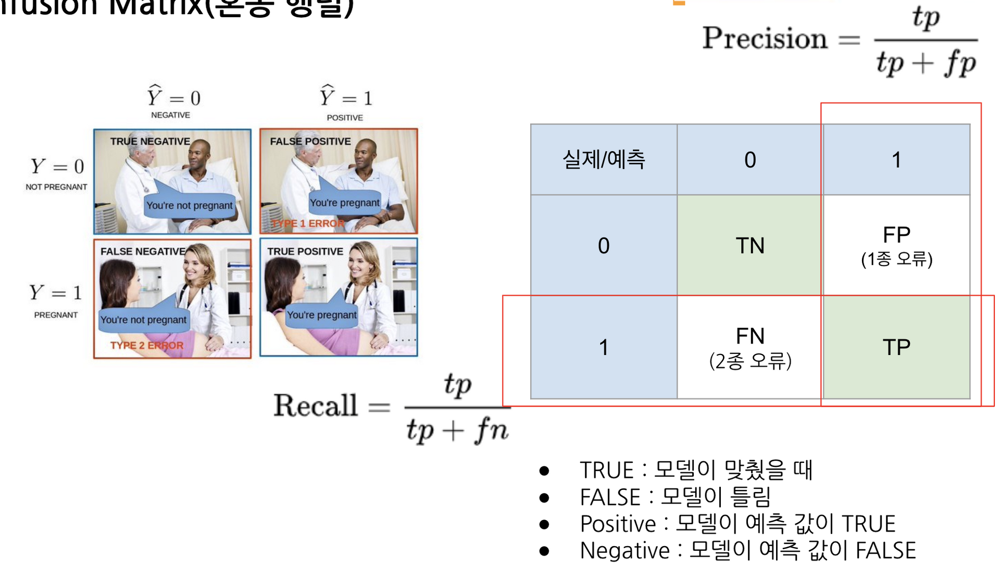

# 🦁 TIL

## ✅ SMOTE

[데이터 출처](https://www.kaggle.com/datasets/mlg-ulb/creditcardfraud)

### - 배경
* 클래스 불균형
  * 현실에서 데이터가 5대 5로 균형있게 존재하는 경우가 거의 없음 
  * 데이터에서 각 클래스의 개수 차이가 큰 현상
  * 분류 모델링 시 정확도 저하 요인 중 하나
  * 불균형 데이터로 생성한 예측 모형은 특정 클래스에 치우치거나, 적절한 평가에 어려움

 

### - 개념
* `SMOTE(Synthetic Minority Over-sampling Technique)`
* 오버샘플링 기법 중 하나
* 클래스 불균형을 해결하기 위한 방법 중 하나 
* 낮은 비율로 존재하는 클래스의 데이터를 `최근접 이웃(K-NN) 알고리즘`을 활용하여 새롭게 생성
* 오버샘플링 기법 중 단순 무작위 추출을 통해 데이터의 수를 늘리는 방법도 존재
  * 데이터를 단순하게 복사하기 때문에 과적합 문제가 발생하기도 함
* SMOTE는 알고리즘 기반으로 데이터를 생성하므로, 과적합 발생 가능성이 단순 무작위 방법보다 적음

 

## ✅ 이진 분류 평가 지표
### - 정확도, Accuracy
* 분류 예측을 성공항 비율
* 일상적인 상황에서는 정확도만 있어도 충분
* 그러나 불균형 데이터의 경우 모델의 성능을 측정하기 어려움
* 자주 일어나진 않지만 한 번이라도 놓치면 치명적
  * 금융 : 대출 사기, 신용카드 사기, 상장폐지 종목 여부
  * 제조업 : 불량품 검출
  * 헬스케어 : 희귀질병 엽우
  * IT 관련 : 게임 어뷰저, 광고 어뷰져

 

### - Confusion Matrix

> * 1종 오류와 2종 오류는 `trade-off` 관계
> * precision이 더 중요한 경우에는 threshold를 올림
> * recall이 중요한 경우에는 threshold를 내림
### - `Precision`, 정밀도
* 예측값이 1인 것을 기준으로 계산
* 모델이 참이라고 예측한 것 중 진짜 참인 비율
* 예측값이 얼마나 정확한가
### - `Recall`, 재현율
* 실제값이 1인 것을 기준으로 계산
* 실제 참인 것 중 모델이 참이라고 예측한 비율
* 실제 정답을 얼마나 맞췄는가
### - `f1-score`
* `Precision` 과 `Recall` 의 조화 평균
* 둘 다 중요한 경우 지표로 사용

 

### - AUC
* 기존에는 예측을 할 때 주로 predict 를 사용
* predict_proba 를 하게 되면 0,1 등의 클래스 값이 아닌 확률값으로 반환
* 임계값(Threshole)을 직접 정해서 True, False를 결정
* 보통 0.5 로 하기도 하고 0.3, 0.7 등으로 정하기도 합니다.
* [참고 자료](https://angeloyeo.github.io/2020/08/05/ROC.html)
  
 

* $TPR=\frac{TP}{TP+FN}$
* 실제 양성 샘플 중 양성으로 예측된 비율
* TP와 FN은 모두 양성 샘플
* TP가 많고 FN이 적을수록 1에 가까워짐

 

* $FPR=\frac{FP}{FP+TN}$
* 음성 샘플 중 양성으로 잘못 예측한 것의 비율
* FP가 적고 TN이 많을수록 0에 가까워짐

